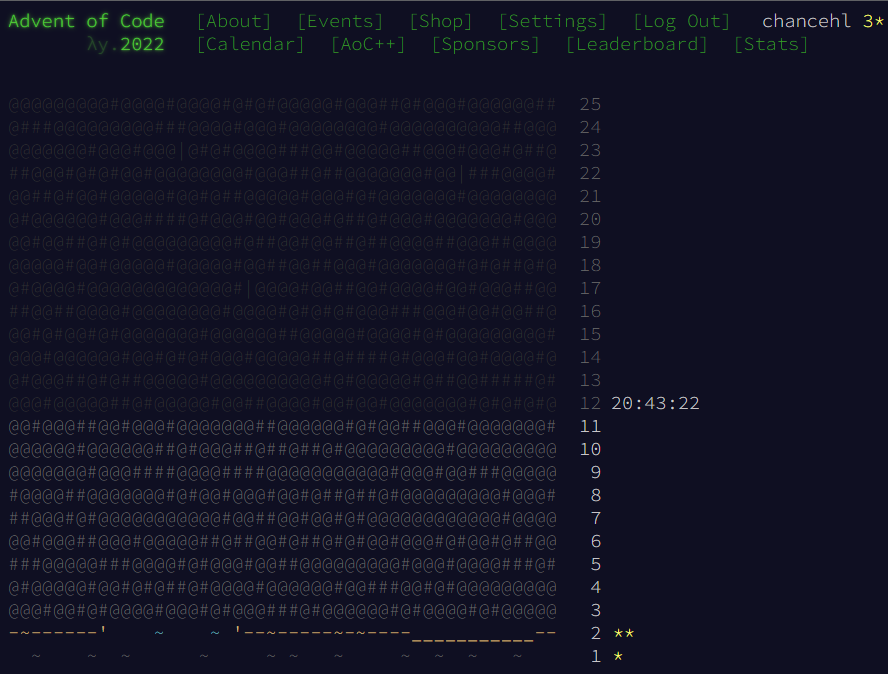

/// https://adventofcode.com/2022/about

Advent of Code is an Advent calendar of small programming puzzles for a variety of skill sets and skill levels that can be solved in any programming language you like. People use them as interview prep, company training, university coursework, practice problems, a speed contest, or to challenge each other.

--- Credits ---
Puzzles, Code, & Design: Eric Wastl

Beta Testing:

Tim Giannetti
Ben Lucek
JP Burke
Aneurysm9
Andrew Skalski
Community Managers: Danielle Lucek and Aneurysm9

Playing: You!

--- Legal ---
Advent of Code is a registered trademark in the United States. The design elements, language, styles, and concept of Advent of Code are all the sole property of Advent of Code and may not be replicated or used by any other person or entity without express written consent of Advent of Code. Copyright 2015-2022 Advent of Code. All rights reserved.

You may link to or reference puzzles from Advent of Code in discussions, classes, source code, printed material, etc., even in commercial contexts. Advent of Code does not claim ownership or copyright over your solution implementation.

